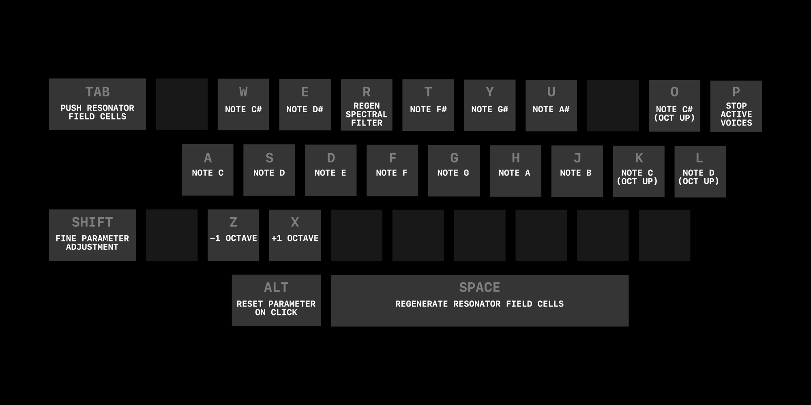

# Creative Coding Project


This is my Creative Coding submission for University. The project is written in Rust, as well as some shaders written in WGSL.

The device has three main parts: 
- A resonator bank, where the resonators are controlled by a small vector field. The vector field is visualised by orange nodes (which you may drag with the mouse) and Voronoi noise generated from the points.
- A spectral filter, which uses a column of pixels to mask audio in the frequency domain. The brighter a pixel is, the louder the magnitude is at its respective frequency. You may drag the orange "scan line" with the mouse, and each visual algorithm offers some control over its appearance. You may also change the resolution (block size) of the spectral filter.
- Post-processing FX, including a simple parametric EQ, distortion, stereo delay, and a compressor. The orange EQ nodes can be dragged with the mouse to control the filters.

You can find the latest build at the [releases](https://github.com/jamiegibney/creative_coding_project/releases) page.

### Keymap
The device's keymap is as follows:



Polyphony is supported. 

**Tip**: whilst holding notes, you can shift the octave with either `Z` or `X` to hold the notes in place, acting as a way of sustaining them. Pressing `P` releases the notes.

### Parameters
Please see the project's [parameter reference](./parameter_reference.md) for more information on each of the device's parameters.

# Navigating the project's source code
> This section is intended for an assessor meaning to read through the project.

### Documentation
Not every part of this project is documented, but many useful objects, methods, and functions are. Some files contain step-by-step comments to explain a process, and others provide documentation comments to explain how a certain function or method should be used. Most documentation is intended to make certain modules easier to use for the programmer using them.

Please note that in Rust, `//` comments are only visible in the source code, but `///` comments are "doc comments" which are exposed by many code editors and in the project's documentation.

#### Viewing the project's documentation in the browser
Documentation for the project is automatically generated and available in `docs/doc/creative_coding_project/index.html`. To view the pre-generated documentation, download this repository, and open the file above.

Alternatively, if you have `cargo` installed, you may run 
```bash
cargo docs --open --no-deps --target-dir=docs/
```
in the source directory to open the documentation. Running 
```bash
cargo docs --open
```
also works, but will generate documentation for all dependencies, and may create another folder.

### Main modules
This project contains several main modules:

- `app`: application-related logic and data, such as the audio processing callback, the application's state, the draw loop, etc.
- `dsp`: digital signal processors, ranging from filters and spectral processors to compression and delay.
- `generative`: creative, "generative" algorithms used to control certain parts of the device.
- `gui`: graphical user-interface logic and components — used for the UI controls and spectrograms, for instance.
- `util`: utility logic, such as decibel-to-level conversion, interpolation, value smoothing, etc.

Also note these top-level files:

- `prelude.rs`: a file to allow easy access to certain code from anywhere in the project.
- `settings.rs`: project-wide settings, such as the window size or sample rate.

And other folders in the project directory:
- `assets`: font files and app icon images.
- `bundles`: pre-compiled app bundles for macOS and Windows. Please treat Windows binaries with caution, as they are not extensively tested.

### Third-party libraries
This project relies on several third-party libraries. All of these are visible in the [`Cargo.toml`](./Cargo.toml) file under the `[dependencies]` section.

### Compiling locally
If you wish to compile the source code yourself:

- Clone or download this repository.
- Ensure you have [installed Rust](https://www.rust-lang.org/tools/install).
- `cd` to the project's working directory.
- Run `cargo build --release` (or `cargo run --release` to run the project).

Compilation will take a while, as there are a few hundred dependencies which also need to be compiled.

Please note that pre-compiled app bundles are generated with [`cargo-bundle`](https://github.com/burtonageo/cargo-bundle).

### Rust help
If you're new to Rust and wish to read the source code, please see [`rust_101.md`](./rust_101.md) for some basic points on its syntax!
